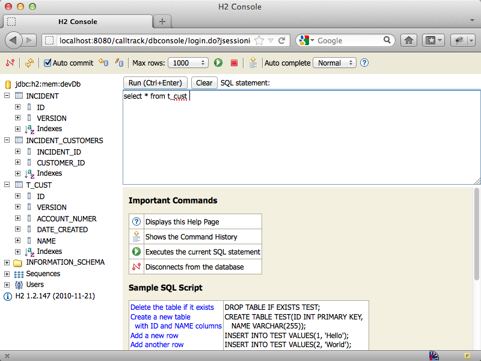
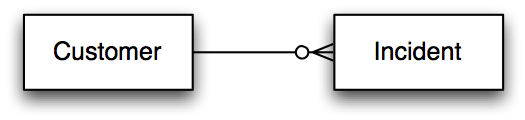
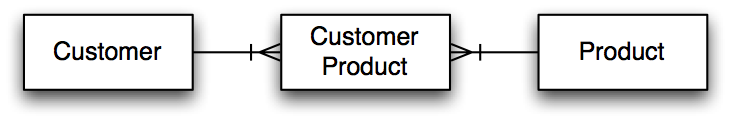

# Object Relational Mapping in Grails

---

## Object Relational Mapping in Grails

- Grails Object Relational Mapping
- CRUD
- Constraints/Validation
- Relationships 

---

# Domain Class Basics

---

## Domain Class Location Convention

<pre class="brush: text; highlight:[6]">
	|____grails-app
	| |____conf
	| | |____hibernate
	| | |____spring
	| |____controllers
	| |____domain
	| |____i18n
	| |____services
	| |____taglib
	| |____utils
	| |____views
</pre>	

The **domain** subdirectory is for any class that you want to be persistent.
These classes are automatically mapped to the DB through Hibernate (or other GORM implementation)

----

## Database Creation Magic

<pre class="brush: groovy; highlight:[11]">
	dataSource {
		pooled = false
		username = "sa"
		password = ""
	    loggingSql = true
	}
	
	environments {
		development {
			dataSource {
				dbCreate = "create-drop"
				//...
			}
		}
		test {
		//...
</pre>
	
----------

## DB creation options 

- create-drop
	- Drop and re-create the database when Grails is run
- create
	- Create the database if it doesn't exist, but don't modify it if it does
- update
	- Create the database if it doesn't exist, and modify it if it does exist
- not defined
	- do nothing to the database
	
---------------

## DB Console 

* grails run-app
* browse to http://localhost:8080/dbconsole
* use driver, username, password, url from `grails-app/conf/DataSource.groovy`

<pre class="brush: groovy; highlight:[2,3,4, 10]">
	dataSource {
	    driverClassName = "org.h2.Driver"
	    username = "sa"
	    password = ""
	}
	environments {
	    development {
	        dataSource {
	            dbCreate = "create-drop" // one of 'create', 'create-drop', 'update', 'validate', ''
	            url = "jdbc:h2:mem:devDb;MVCC=TRUE"
	        }
	    }
</pre>

---------------

---------------

-----------

<pre class="brush: groovy; highlight:[1]">
	class Customer {
		String name
		String accountNumber
	}
</pre>

<pre class="brush: text; highlight:[1]">
	mysql> describe customer;
	+----------------+--------------+------+-----+---------+
	| Field          | Type         | Null | Key | Default |
	+----------------+--------------+------+-----+---------+
	| id             | bigint(20)   | NO   | PRI | NULL    |
	| version        | bigint(20)   | NO   |     | NULL    |
	| account_number | varchar(255) | NO   |     | NULL    |
	| name           | varchar(255) | NO   |     | NULL    |
	+----------------+--------------+------+-----+---------+
	4 rows in set (0.02 sec)
</pre>

class name becomes table name

--------

<pre class="brush: groovy; highlight:[2,3]">
	class Customer {
		String name
		String accountNumber
	}
</pre>

<pre class="brush: text; highlight:[7,8]">
	mysql> describe customer;
	+----------------+--------------+------+-----+---------+----------------+
	| Field          | Type         | Null | Key | Default | Extra          |
	+----------------+--------------+------+-----+---------+----------------+
	| id             | bigint(20)   | NO   | PRI | NULL    | auto_increment | 
	| version        | bigint(20)   | NO   |     | NULL    |                | 
	| account_number | varchar(255) | NO   |     | NULL    |                | 
	| name           | varchar(255) | NO   |     | NULL    |                | 
	+----------------+--------------+------+-----+---------+----------------+
	4 rows in set (0.02 sec)
</pre>

attribute names are converted into column names

--------

<pre class="brush: groovy">
	class Customer {
		String name
		String accountNumber
	}
</pre>

<pre class="brush: text; highlight:[5,6]">
	mysql> describe customer;
	+----------------+--------------+------+-----+---------+----------------+
	| Field          | Type         | Null | Key | Default | Extra          |
	+----------------+--------------+------+-----+---------+----------------+
	| id             | bigint(20)   | NO   | PRI | NULL    | auto_increment | 
	| version        | bigint(20)   | NO   |     | NULL    |                | 
	| account_number | varchar(255) | NO   |     | NULL    |                | 
	| name           | varchar(255) | NO   |     | NULL    |                | 
	+----------------+--------------+------+-----+---------+----------------+
	4 rows in set (0.02 sec)
</pre>

id (PK) and version (optimistic locking) columns are added to DB, but don’t need to be explicitly specified in code

--------

## ID and Version - invisible attributes?

- ID and Version were added to the DB table for Customer
- Where did they come from?

--------

## javap

<pre class="brush: text; highlight:[7,8]">
	javap Customer
	Compiled from "Customer.groovy"
	public class calltrack.Customer 
		extends java.lang.Object 
		implements groovy.lang.GroovyObject {

			java.lang.Long id;
			java.lang.Long version;
			
			private java.lang.String name;
			private java.lang.String accountNumber;
			
			//. getters, setters, etc
		}
</pre>

--------

# CRUD

--------

## CRUD

- Four basic functions of persistent storage:
	- CREATE - `INSERT`
	- READ - `SELECT`
	- UPDATE - `UPDATE`
	- DELETE - `DELETE`

---

## SQL Logging

- turn on SQL logging with `logSql = true` in `grails-app/conf/DataSource.groovy`

<pre class="brush: groovy; highlight:[5]">
	dataSource {
		pooled = false
		username = "sa"
		password = ""
	    logSql = true
	}
</pre>
	
---

## Create

<pre class="brush: java; highlight:[4]">
    void testCreate() {
        Customer customer = 
			new Customer(name: 'Mike', accountNumber: '123')
        customer.save()
    }	
</pre>

<pre class="brush: sql;">
	INSERT INTO customer
	    (
	        id, version, account_number, date_created, name
	    )
	    VALUES
	    (
	        NULL, ?, ?, ?, ?
	    );
</pre>

---

## Read

<pre class="brush: java; highlight:[2,5]">
    void testRead() {
        Customer customer = Customer.read(1)
    }
    void testGet() {
        Customer customer = Customer.get(1)
    }
</pre>

<pre class="brush: sql;">
	SELECT
	    customer0_.id             AS id0_0_,
	    customer0_.version        AS version0_0_,
	    customer0_.account_number AS account3_0_0_,
	    customer0_.date_created   AS date4_0_0_,
	    customer0_.name           AS name0_0_
	FROM
	    customer customer0_
	WHERE
	    customer0_.id=?
</pre>

---

## Update
<pre class="brush: java; highlight:[8]">
void testUpdate() {
    //setup
    def c = new Customer(name: 'Mike',
            accountNumber: '123').save()
    //update
    Customer customer = Customer.get(c.id)
    customer.name = 'new value'
    customer.save()
}
</pre>

<pre class="brush: sql;">
	UPDATE customer
	SET
	    version=?,
	    account_number=?,
	    date_created=?,
	    name=?
	WHERE
	    id=?
	AND version=?
</pre>

---

## Implicit Update

<pre class="brush: java; highlight:[15, 16, 17]">
void testUpdateImplicit() {
    assert 0 == Customer.count()

    def c = new Customer(name: 'Mike', accountNumber: '123');
    c.save();

    c.name = 'Jim'
    c.save()

    assert c.name == Customer.get(c.id).name

    // beware the implicit update
    c.name = 'John'

    // even though c.save() hasn't been called,
    // the new name 'John' has been persisted!
    assert 'John' == Customer.get(c.id).name
}
</pre>

---

## Delete
<pre class="brush: java; highlight:[7]">
void testDelete() {
    //setup
    def c = new Customer(name: 'Mike',
            accountNumber: '123').save()
    //delete
    Customer customer = Customer.get(c.id)
    customer.delete()
}
</pre>

<pre class="brush: sql;">
delete from customer where id=? and version=?
</pre>

---

## Locking

<cite>http://www.toadworld.com/Portals/0/GuyH/
	Contention/Feb2008/optimisticPessimistic.jpg</cite>
 
---

## Optimistic Locking (Default)

- Version column 

<pre class="brush: sql;">
delete from customer where id=? and version=?
</pre>
<pre class="brush: sql; highlight:[3,9]">
	UPDATE customer
	SET
	    version=?,
	    account_number=?,
	    date_created=?,
	    name=?
	WHERE
	    id=?
	AND version=?
</pre>

- Version incremented with each update

---

## Pessimistic Locking
<pre class="brush: java; highlight:[7]">
void testLock() {
	//setup
	def c = new Customer(name: 'Mike',
	 	accountNumber: '123').save()
	//use lock method to perform SELECT ... FOR UPDATE
	Customer.withTransaction {
	    Customer customer = Customer.lock(c.id)
	    customer.name = 'John'
	    customer.save(flush: true)
	}
	// lock is automatically released at end of transaction
	assert 'John' == Customer.get(c.id).name
}
</pre>

---

## Constraints and Validation

- By default, all properties are required (i.e. can’t be NULL)

<pre class="brush: groovy;">
def c = new Customer()
c.save()
println c.errors
</pre>

<pre class="brush: text;highlight:[5,8]">
org.springframework.validation.BeanPropertyBindingResult:
  2 errors
Field error in object 'Customer' on field 'accountNumber': 
	rejected value [null]; codes [......; default message 
	[Property [{0}] of class [{1}] cannot be null]
Field error in object 'Customer' on field 'name': 
	rejected value [null]; codes [......; default message 
	[Property [{0}] of class [{1}] cannot be null]
</pre>

---

## Constraints closure

- By default, all properties are required (i.e. can’t be NULL)

<pre class="brush: groovy;">
class Customer { 
	String name
	String accountNumber
}
</pre>
is the same as
<pre class="brush: groovy;highlight:[4,5,6,7]">
class Customer { 
	String name
	String accountNumber
	static constraints = {
		name(nullable:false)
		accountNumber(nullable:false)
	}
}
</pre>

---

## Built In Constraints

- `blank` - cannot be empty string
- `creditCard` - matches a credit card number
- `email` - valid email address
- `inList` - contained in a list of values
- `matches` - applies a regular expression
- `max` - maximum value of a class that implements comparable
- `min` - minimum value of a class that implements comparable
- `notEqual` - not equal to a specified value

---

## Built In Constraints

- `nullable` - set to false for NOT NULL constraint
- `range` - within a min and max
- `scale` - performs rounding to a specified precision (doesn’t generate error messages)
- `size` - length of a string or collection
- `unique` - unique value
- `url` - URL address
- `validator` - custom validator

---

## Some constraints influence schema 

<pre class="brush: groovy;">
String name
String accountNumber
String phone
Date dateCreated
static constraints = {
	// name must be at least 2 chars; no more than 100
	name(nullable:false, size:2..100)
	// account number min length of 1 and max of 5 chars
	accountNumber(nullable:true, size:1..5)
	// phone number must be 10 digits
	phone(nullable:true, matches: /(\d{10})?/)
}
</pre>

---

<pre class="brush: groovy; highlight:[4]">
// ...
static constraints = {
	// name must be at least 2 chars; no more than 100
	name(nullable:false, size:2..100)
	// account number min length of 1 and max of 5 chars
	accountNumber(nullable:true, size:1..5)
	// phone number must be 10 digits
	phone(nullable:true, matches: /(\d{10})?/)
	// dateCreated not specified
}
</pre>

<pre class="brush: text; highlight:[9]">
mysql> describe customer;
+----------------+--------------+------+-----+---------+
| Field          | Type         | Null | Key | Default |
+----------------+--------------+------+-----+---------+
| id             | bigint(20)   | NO   | PRI | NULL    |
| version        | bigint(20)   | NO   |     |         |
| account_number | varchar(5)   | YES  |     | NULL    |
| date_created   | datetime     | NO   |     |         |
| name           | varchar(100) | NO   |     |         |
| phone          | varchar(255) | YES  |     | NULL    |
+----------------+--------------+------+-----+---------+
</pre>

name field gets max length in DB of 100

---

<pre class="brush: groovy; highlight:[6]">
// ...
static constraints = {
	// name must be at least 2 chars; no more than 100
	name(nullable:false, size:2..100)
	// account number min length of 1 and max of 5 chars
	accountNumber(nullable:true, size:1..5)
	// phone number must be 10 digits
	phone(nullable:true, matches: /(\d{10})?/)
	// dateCreated not specified
}
</pre>

<pre class="brush: text; highlight:[7]">
mysql> describe customer;
+----------------+--------------+------+-----+---------+
| Field          | Type         | Null | Key | Default |
+----------------+--------------+------+-----+---------+
| id             | bigint(20)   | NO   | PRI | NULL    |
| version        | bigint(20)   | NO   |     |         |
| account_number | varchar(5)   | YES  |     | NULL    |
| date_created   | datetime     | NO   |     |         |
| name           | varchar(100) | NO   |     |         |
| phone          | varchar(255) | YES  |     | NULL    |
+----------------+--------------+------+-----+---------+
</pre>

account number nullable and max length of 5

---

<pre class="brush: groovy; highlight:[8]">
// ...
static constraints = {
	// name must be at least 2 chars; no more than 100
	name(nullable:false, size:2..100)
	// account number min length of 1 and max of 5 chars
	accountNumber(nullable:true, size:1..5)
	// phone number must be 10 digits
	phone(nullable:true, matches: /(\d{10})?/) // no size
	// dateCreated not specified
}
</pre>

<pre class="brush: text; highlight:[10]">
mysql> describe customer;
+----------------+--------------+------+-----+---------+
| Field          | Type         | Null | Key | Default |
+----------------+--------------+------+-----+---------+
| id             | bigint(20)   | NO   | PRI | NULL    |
| version        | bigint(20)   | NO   |     |         |
| account_number | varchar(5)   | YES  |     | NULL    |
| date_created   | datetime     | NO   |     |         |
| name           | varchar(100) | NO   |     |         |
| phone          | varchar(255) | YES  |     | NULL    |
+----------------+--------------+------+-----+---------+
</pre>

phone number gets default max size of 255 and nullable

---

<pre class="brush: groovy; highlight:[9]">
// ...
static constraints = {
	// name must be at least 2 chars; no more than 100
	name(nullable:false, size:2..100)
	// account number min length of 1 and max of 5 chars
	accountNumber(nullable:true, size:1..5)
	// phone number must be 10 digits
	phone(nullable:true, matches: /(\d{10})?/) // no size
	// dateCreated not specified
}
</pre>

<pre class="brush: text; highlight:[8]">
mysql> describe customer;
+----------------+--------------+------+-----+---------+
| Field          | Type         | Null | Key | Default |
+----------------+--------------+------+-----+---------+
| id             | bigint(20)   | NO   | PRI | NULL    |
| version        | bigint(20)   | NO   |     |         |
| account_number | varchar(5)   | YES  |     | NULL    |
| date_created   | datetime     | NO   |     |         |
| name           | varchar(100) | NO   |     |         |
| phone          | varchar(255) | YES  |     | NULL    |
+----------------+--------------+------+-----+---------+
</pre>

date_created gets default not nullable

---

# Validation

---

## Validation

- validation is implicitly called when .save() is called, but can also be called independently:

<pre class="brush:groovy;">
groovy> def c = new Customer()
groovy> println c.validate()
false	
</pre>

- if validation fails, errors are placed in the errors property of the domain class
	- can also check hasErrors()

<pre class="brush:groovy;">
groovy> def c = new Customer()
groovy> c.validate()
groovy> println c.hasErrors()
true
</pre>

---

## Validation

- Note that by default .save() does not throw an exception if validation fails and entity is NOT persisted

<pre class="brush:groovy;">
groovy> def c = new Customer()
groovy> c.validate()
groovy> println c.hasErrors()
true
</pre>

<pre class="brush:sql;">
mysql> select count (*) from customer;
+----------+
| count(*) |
+----------+
|        0 |
+----------+
1 row in set (0.00 sec)
</pre>

---

## Validation

- Can be overridden by using “failOnError:true” in the .save() call

<pre class="brush:groovy;">
groovy> new Customer().save(failOnError:true) 
//...
Exception thrown
//...
grails.validation.ValidationException: 
  Validation Error(s) occurred during save():
- Field error in object 'caller.Customer' on field 
  'address': rejected value [null]; codes
</pre>

- Can also be overridden globally in `grails-app/conf/Config.groovy`
	- `grails.gorm.failOnError=true`

---

# Relationships

---

## Many to One - Unidirectional

<pre class="brush:groovy;">
class Customer {
	Address address
}
class Address {
}	
</pre>

- Unidirectional many-to-one relationship from Customer to Address
- Address is not aware  of Customer

---

## Many to One - Unidirectional

<pre class="brush:groovy;">
class Customer {
	Address address
}
class Address {
}	

customer.address = new Address()
customer.save()
//transient object exception


def address = new Address()
address.save()
customer.address = address
customer.save()
//OK
</pre>

- Updates do not cascade

---

## Many to One - Unidirectional

<pre class="brush:groovy;">
class Customer {
	Address address
}
class Address {
}	

def address = new Address()
address.save()
customer.address = address
customer.save()

address.delete()
//FK constraint exception

customer.delete()
address.delete()
//OK
</pre>

- Deletes do not cascade

---

## Many to One - Bidirectional

<pre class="brush:groovy; highlight:[5]">
class Customer {
	Address address
}
class Address {
	static belongsTo = [customer:Customer]
}
</pre>

- Address belongs to Customer
- Saves and Deletes to Customer will cascade to Address

<pre class="brush:groovy;">
customer.address = new Address()
customer.save()
//OK
//saves both customer and address

customer.delete()
//OK
//deletes customer and address	
</pre>

---
 
## One to Many

- use "static hasMany = ..." definition
- inserts and updates are cascaded
- deletes cascade if belongsTo is defined
	
---

## One to Many

- default is java.util.Set; can use
	- SortedSet (must implement comparable)
	- List (adds {table}_idx column)
- convenience methods:
	- customer.addToIncidents(incident)
	- customer.removeFromIncidents(incident)
	
---

## One to Many

<pre class="brush:groovy;">
class Customer { 
	static hasMany = [incidents:Incident]
}

class Incident {
    static belongsTo = [customer:Customer]
}


//saves both Customer and Incident
def c = new Customer()
c.addToIncidents(new Incident())
c.save()

//deletes customer and all associated incidents
c.delete()	
</pre>

---

## Many to Many

- both sides define hasMany
- must define an owner (using belongsTo on the owned object)

---

## Many to Many

<pre class="brush:groovy;">
class Customer { 
	static hasMany = [products:Product]
}

class Product { 
    static hasMany = [customers:Customer]
	//Customer owns the relationship
    static belongsTo = Customer 
	//inserts will cascade from customer not from product
}
</pre>

---

## Many to Many

- Realistically, there is often a concrete entity between the two sides of the relationship

<pre class="brush:groovy;">
class Customer { 
	static hasMany = [products:CustomerProduct]
}

class CustomerProduct {
	Customer customer
	Product product
	Date datePurchased
	static belongsTo = [Customer, Product]
}

class Product { 
    static hasMany = [customers:CustomerProduct]
}
</pre>
