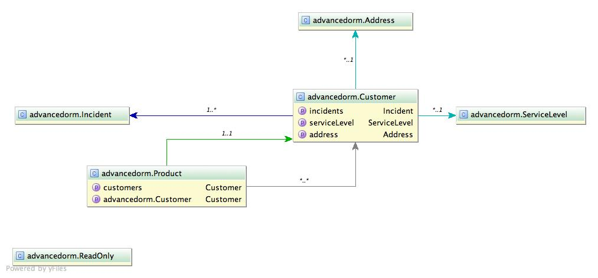
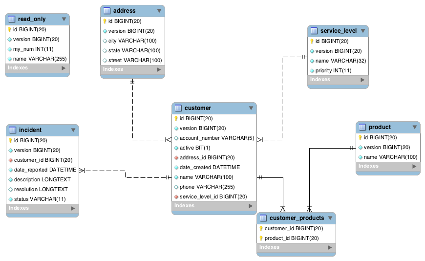

# Introduction to Object Relational Mapping

---

---

---

## impedance mismatch

http://www.flickr.com/photos/jeffsand/3871415191

--- 

## Why

- Relational Databases are common
- Proven mathematical foundation
- Mature products (both for profit and open source)

---

## Object Relational Impedance Mismatch

- Inheritance
- Different data types (String vs. VARCHAR)
	- true, false, empty, null?
- Relationships
	- objects are related by reference, DB records related by primary and foreign keys
- Identity

---

## It's changing

- NoSQL - Not Only SQL
	- key/value
	- document 
	- graph
	- column
- Relational model isn't *always* the best mechanism to store data for every application

--- 

## ORM patterns

- Service / Data Transfer Object
- Data Access Object
- Active Record
	
-------

## References
- http://www.agiledata.org/essays/mappingObjects.html
- "Persistence in the Enterprise: A Guide to Persistence Technologies" Geoffrey Hambrick
- http://en.wikipedia.org/wiki/Relational_model