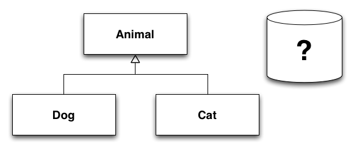
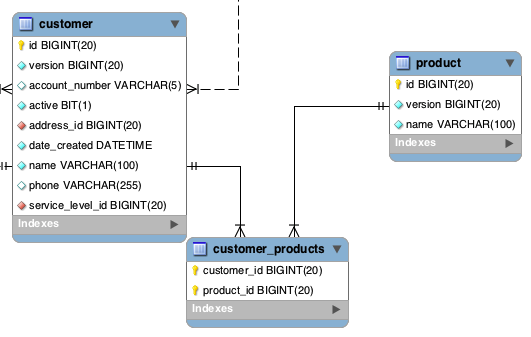

# Introduction to Object Relational Mapping

---

---

---

## Object Relational Impedance Mismatch

- Inheritance, abstraction, polymorphism

---

## Object Relational Impedance Mismatch

- Different data types (String vs. VARCHAR(255))

<pre class="brush: groovy">
	class Customer {
		Long id
		String name // how many characters long could this be?
	}
</pre>

<pre class="brush:text; highlight:[];">
	mysql> describe customer;
	+----------------+--------------+------+-----+---------+
	| Field          | Type         | Null | Key | Default |
	+----------------+--------------+------+-----+---------+
	| id             | bigint(20)   | NO   | PRI | NULL    |
	| name           | varchar(255) | NO   |     | NULL    |
	+----------------+--------------+------+-----+---------+
</pre>

---

## Object Relational Impedance Mismatch

- Relationships
	- objects are related by reference, DB records related by primary and foreign keys

 

---

## impedance mismatch

http://www.flickr.com/photos/jeffsand/3871415191

--- 

## Why 

- Databases are good at storing data
- Relational Databases are common
- Proven mathematical foundation
	- Edgar F. Codd, "A Relational Model of Data for Large Shared Data Banks" 1970
- Mature products (both for profit and open source)
	- Oracle, SQL Server
	- MySql, PostgreSQL

---

## It's changing

- NoSQL - Not Only SQL
	- key/value
	- document 
	- graph
	- column
- Relational model isn't *always* the best mechanism to store data for every application

--- 

## ORM Persistence patterns

- Service / Data Transfer Object

<pre class="brush: groovy">
	class Customer { // domain class
		Long id
		String name
		CustomerDTO buildDto(){...}
	}

	class CustomerDto { // data transfer object
		Long id
		String name
	}
	
	class CustomerService { // persistence logic
		void save(CustomerDto){....}
		CustomerDto read(Long id){....}
	}
</pre>

-------

## ORM Persistence patterns

- Data Access Object

<pre class="brush: groovy">
	class Customer { // domain class
		Long id
		String name
	}

	class CustomerDao { // data access object
		void save(CustomerDao){....}
		CustomerDao read(Long id){....}
	}
</pre>

	
-------

## ORM Persistence patterns

- Active Record

<pre class="brush: groovy">
	class Customer { // domain class
		Long id
		String name

		void save(){....}
		Customer read(Long id){....}
	}
</pre>

-------

## ORM Frameworks (just to name a few)

- Java
	- Hibernate (Grails default)
	- IBATIS
	- JDO
	- EclipseLink
- .NET
	- NHibernate
	- Entity Framework

-------

## References
- http://www.agiledata.org/essays/mappingObjects.html
- "Persistence in the Enterprise: A Guide to Persistence Technologies" Geoffrey Hambrick
- http://en.wikipedia.org/wiki/Relational_model
- http://www.dcs.fmph.uniba.sk/diplomovky/obhajene/getfile.php/dp.orsag.orm.pdf?id=86&fid=147&type=application%2Fpdf
- http://www.seas.upenn.edu/~zives/03f/cis550/codd.pdf